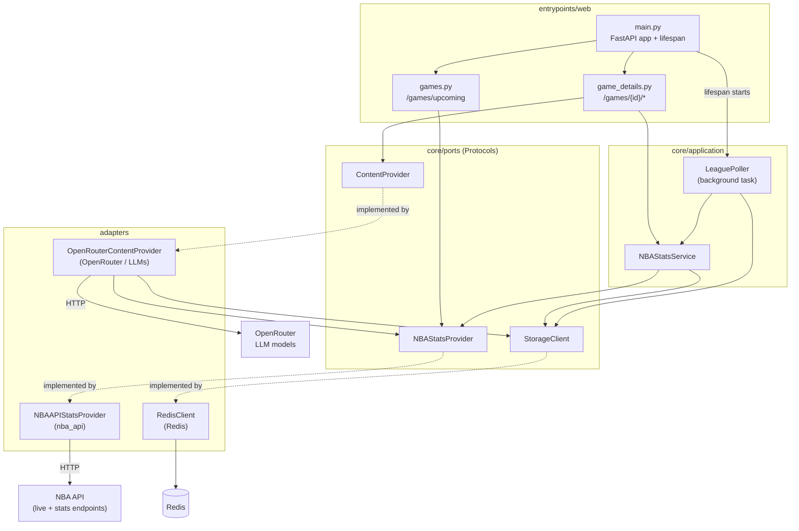
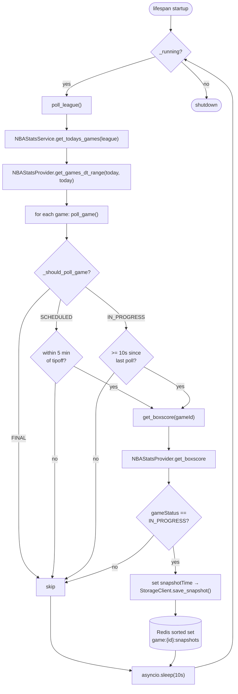
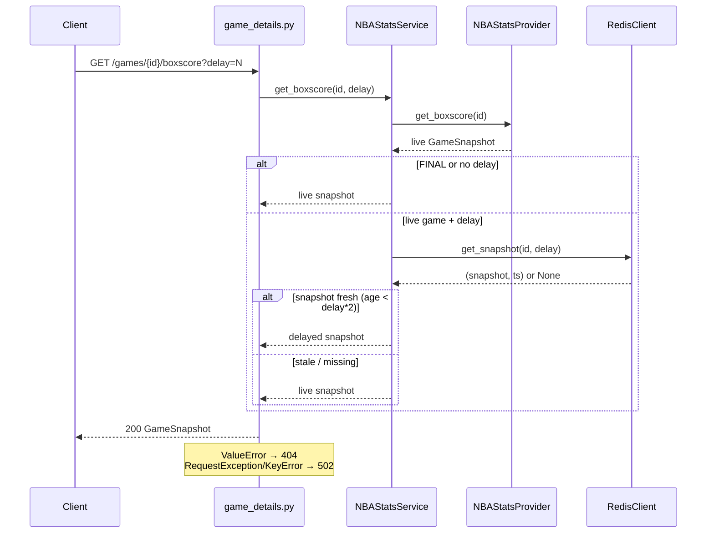
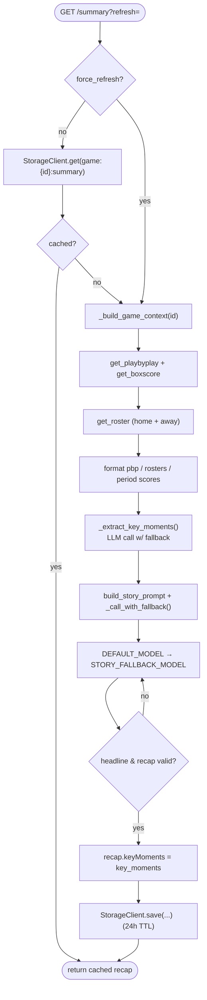
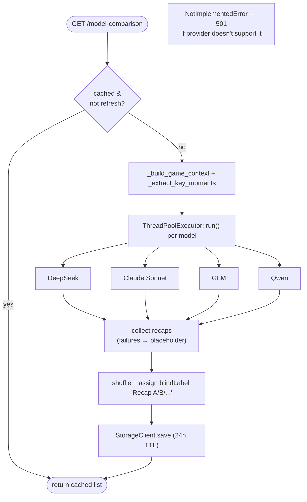

# Basketpal Backend Flows

Mermaid diagrams of the FastAPI backend's request and background flows. The
backend follows a hexagonal architecture: HTTP entrypoints → application
services → ports (interfaces) → adapters (NBA API, Redis, OpenRouter).

## 1. Component / dependency wiring

> In `MOCK_DATA` mode (`dependencies.py`), the adapters are swapped for
> `MockNBAStatsProvider`, `NullStorageClient`, and `MockContentProvider`.

## 2. Background polling flow (LeaguePoller)

Started as a FastAPI lifespan task; loops every 10s and snapshots live games.

## 3. Boxscore request with broadcast delay

`GET /games/{id}` and `/games/{id}/boxscore?delay=N`

## 4. AI game summary flow

`GET /games/{id}/summary?refresh=`

## 5. Model-comparison flow (blind recap)

`GET /games/{id}/model-comparison?refresh=`

## Other endpoints

| Endpoint | Flow |
|---|---|
| `GET /games/upcoming` | `games.py` → `NBAStatsProvider.get_games_dt_range(start, end, league)` (defaults: today → +13 days) |
| `GET /games/{id}/playbyplay` | `game_details.py` → `NBAStatsService.get_playbyplay` → `NBAStatsProvider.get_playbyplay` |
